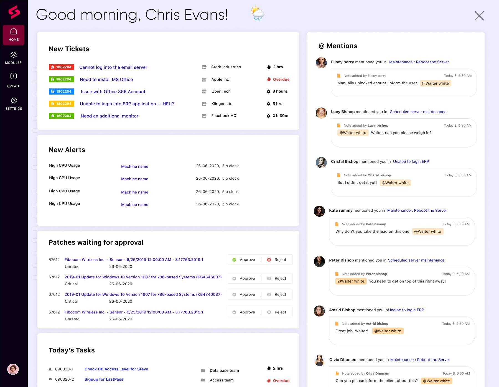
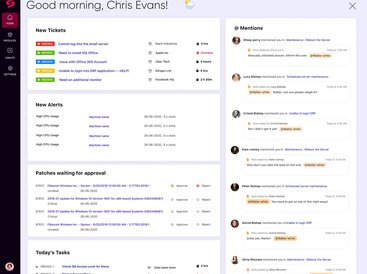
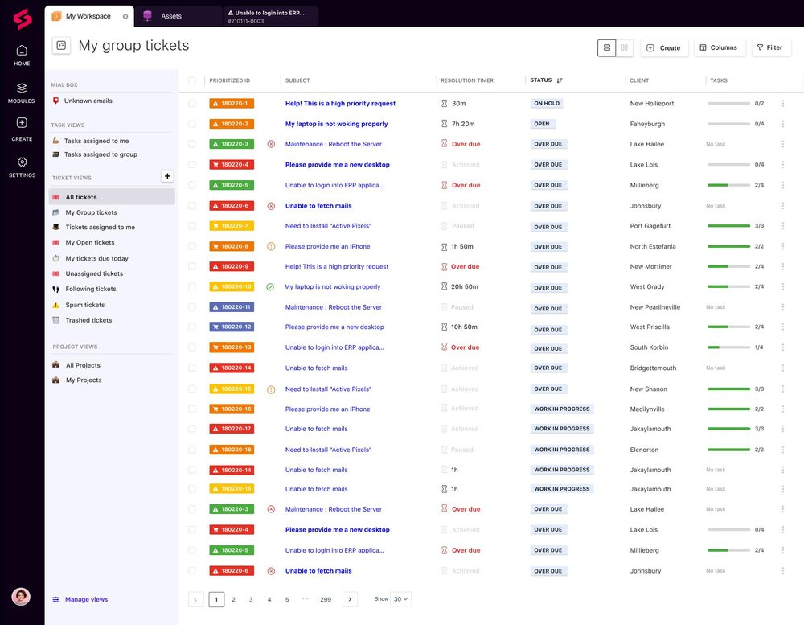

# SuperOps

**Learn about SuperOps.**

 

### 

[**Visit SuperOps on SOFTGIT**](https://softgit.pro/p/superops) · [Browse apps](https://softgit.pro)

---

## Overview

Learn about SuperOps.

Learn about SuperOps. Read SuperOps reviews from real users, and view pricing and features of the MSP software

## At a glance

- Category: AI & Productivity
- Publisher / site: superops.com
- Listing tag: Free trial
- Official site (from listing): https://superops.com/
- Source listing: https://sourceforge.net/software/product/SuperOps/
- Type: Business / SaaS listing (information page)

## Screenshots

  
  
  
  
  
  

## System / listing information

| Field | Value |
|---|---|
| Name | SuperOps |
| Category | AI & Productivity |
| Publisher | superops.com |
| Platform | Any |
| License / offer | Free trial |
| Updated | October 6, 2026 |
| Listed package size | 1.1 MB |

## How to get started

1. Open the [SuperOps page on SOFTGIT](https://softgit.pro/p/superops).
2. Review the overview, screenshots, and any official website link on that page.
3. Use the page CTA to visit the vendor site or request access / trial as offered there.
4. This GitHub repo is an informational listing only — it does not host SaaS installers or account credentials.

[**Visit SuperOps on SOFTGIT**](https://softgit.pro/p/superops)

## FAQ

**What is this repository?**  
An unofficial information page for SuperOps, with links to the [SOFTGIT listing](https://softgit.pro/p/superops).

**Is software redistributed here?**  
No. SaaS products are used via the vendor’s website or apps. Do not treat any third-party zip on a listing as the product itself without verifying the source.

**Who owns this product?**  
Third-party software/service, all rights belong to the original authors and trademark owners. This repo is not affiliated with them.

---

[**Visit SuperOps**](https://softgit.pro/p/superops) · [SOFTGIT](https://softgit.pro)

Third-party software/service, all rights belong to the original authors. Unofficial listing for SuperOps.

## More links

- 🌐 **[Visit SuperOps on SOFTGIT](https://softgit.pro/p/superops)** — the full listing.
- 📄 **[SuperOps web page](https://grindsibearing.github.io/superops-download/)** — standalone info page.
- 🗂️ [More AI & Productivity software](https://softgit.pro/category/ai-productivity)
- 🏠 [SOFTGIT home](https://softgit.pro) · [All apps](https://softgit.pro/apps)
- 🔒 [Verify a download (SHA-256)](https://softgit.pro/security)

> Unofficial listing for SuperOps. Third-party software; all rights belong to the original authors.
